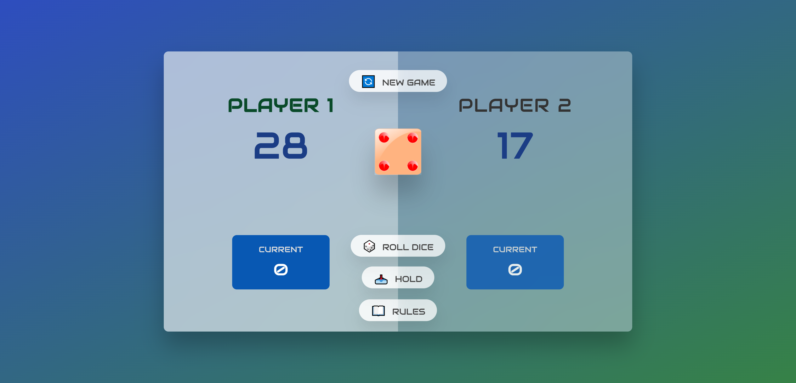

# Two-Player-Dice-Game

## Link:

Play the game here:
https://mully7773.github.io/Two-Player-Dice-Game/

## Description

A fun dice game (AKA 'Pig') I built with HTML, CSS, and vanilla JavaScript that you can play with a friend.
Like the Retro-Number-Guesser before it, this project was inspired by Jonas Schmedtmann's wonderful JavaScript course, and was created to practice DOM manipulation. Read how to play below.

## Rules:

1. Players repeatedly roll a die until either a 1 is rolled or the
   player clicks the 'Hold' button.
    
    
2. If a player rolls a 1, their current score is decreased to 0.
    
    
3. If a player rolls any other number, it is added to their current
   total. The player may repeatedly roll the die until they accumulate a
   high current score to deposit into their overall score.
    
    
4. If a player clicks the 'Hold' button, their current total is added
   to their overall score, and it becomes the next player's turn.
    
    
5. The first player to reach an overall score of 100 or more points
   wins. Note that in order to win, the player must click the 'Hold'
   button after they will pass the 100 point threshold.
    
    
    
   (Rules summarized from Wikipedia)

## Questions:

Feel free to contact me at mully7773@gmail.com if you have any questions.  
You can view more of my projects at https://github.com/Mully7773.

## License:

This project is licensed under MIT.
